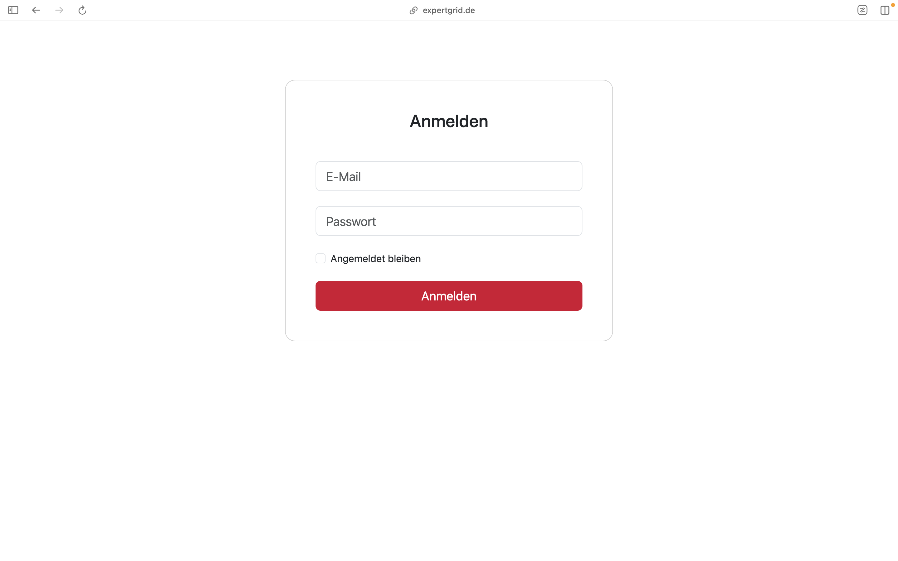

## 1. Login

- **Login Screen:** Users can log in using their credentials. When clicking on `Angemeldet bleiben` you stay signed in even after refreshing the page or closing your browser. With clicking on `Anmelden` after entering your credentials you are done with the login.

---

## 2. User Management

### Overview

- **User Management Screen:** Allows administrators to manage user accounts and roles aswell as delete user accounts.

### Edit User

- **Edit profile Screen:** After clicking on `Bearbeiten` you get to the screen where you can change the role, with clicking on `Role` you are able to change the role of each users if you are a admin.
- **Functions:** You can send an invitation to an expert.

---

## 3. Categories

- **Categories Screen:** Organize and manage the areas of expertise.
- **Functions:** Add with `Neues Themen-/Fachgebiet`, edit with `Bearbeiten`, and delete with `Löschen`

---

## 4. Course Modules

- **Course Modules Screen:** Manage educational and training modules associated with projects or experts.  
- **Functions:** Add with `Neues Kursmodul`, edit with `Bearbeiten`, and delete with `Löschen`

---

## 5. Projects Overview

### Project List

- **Search Bar:** Look for project using their names or filter them by `Fachgebiete`, `Schwerpunktthemen` and `Ort`.  
- **Add a Project:** If you click on `Neues Projekt` you create a blank project and can fill in its information.

### Project Details

- **Project Details Screen:** View comprehensive project information, including associated experts.

### Create or Edit Projects

- **Create/Edit Project Screen:** Add new projects or modify existing ones.  
- **Fields:** Includes project name, schedule, participants, location, and more.
- **After filling in the information:** save your project with a click on `Speichern` or cancel it with a click on `Abbrechen`.

---

## 6. Experts Overview

### Expert List

- **Search Bar:** Look for experts using their names or filter them by `Sprache` and `Reisebereitschaft`.  
- **Add an Expert:** If you click on `+Neue/n Expert*in` you create a blank expert and can fill in its information.

### Create or Edit Experts

- **Expert Input Fields:**  
  - Personal Information: Name, title, and contact details.  
  - Expertise: Select from predefined categories.  
  - Rates and Availability: Specify hourly/daily rates and availability.  
  - Documents: Upload CV or certificates.
- **After filling in your information:** save your profile with a click on `Speichern` or cancel it with a click on `Abbrechen`.

### Expert Details

- **View Expert Details:** Displays all relevant information about an expert, such as experience, certifications, and projects. And you are able to view and download the CV and certificates.

